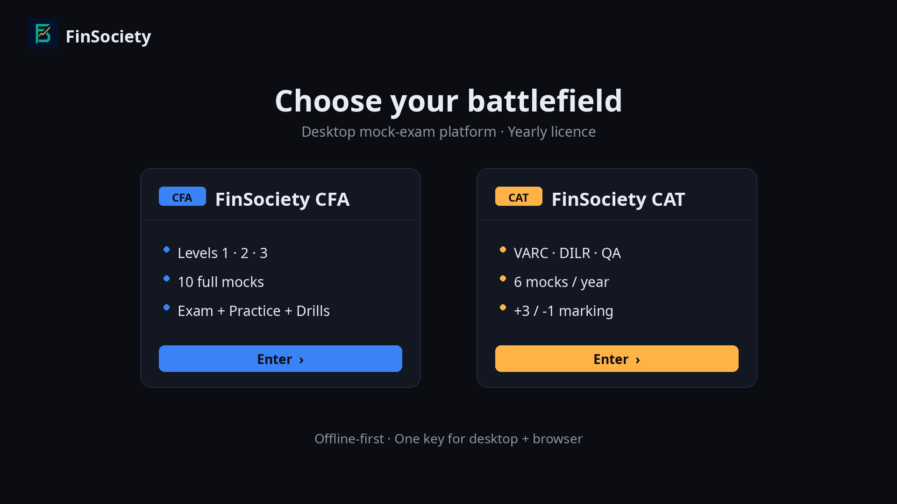
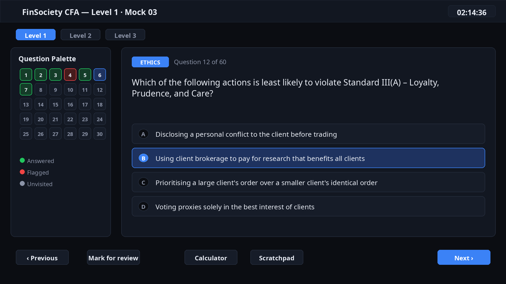
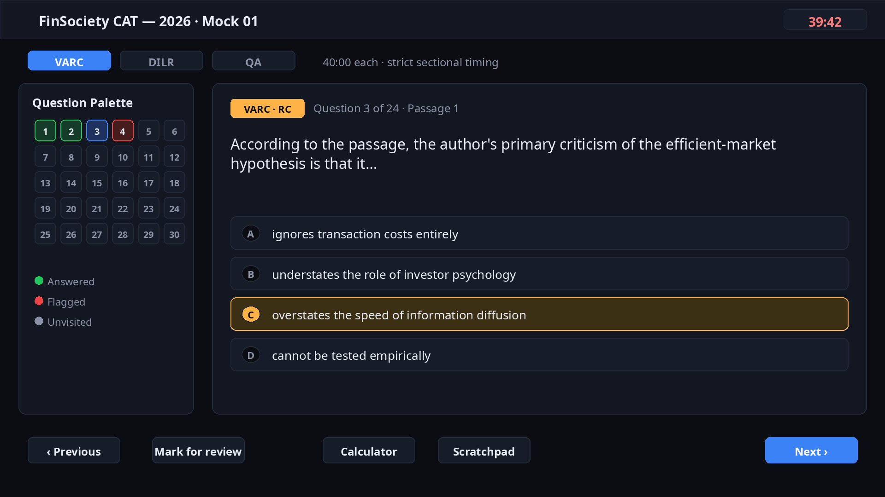
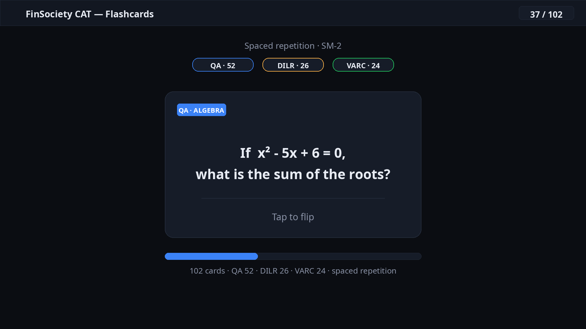
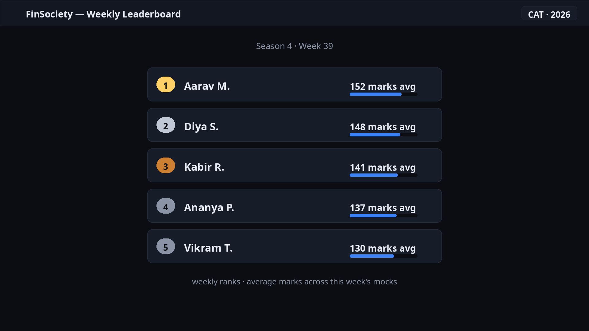

# FinSociety

### Exam-grade mock software for CFA Levels 1–3 and CAT — on Windows and in the browser, under one licence key.

[Website](https://finsociety.pages.dev) · [Get a licence key](https://finsociety.pages.dev/get-access.html) · [All releases](https://github.com/ictramfx-coder/FinSociety-Updates/releases)

---

## Preview

*Concept renders from the app's design system — illustrative, not actual screenshots.*

| | |
|---|---|
|  |  |
| *Pick your track — CFA or CAT* | *True exam conditions with a live question palette* |
|  |  |
| *Sectional timing, TITA inputs, +3/−1 marking* | *Spaced-repetition flashcards built in* |

*Weekly leaderboards to keep the grind competitive*

---

## Download

| Channel | Details |
|---|---|
| **Latest release (recommended)** | [FinSociety CFA v2.0.2](https://github.com/ictramfx-coder/FinSociety-Updates/releases/latest) — Windows installer, ~105 MB |
| All versions & checksums | [Releases page](https://github.com/ictramfx-coder/FinSociety-Updates/releases) |
| Mirror | [Google Drive direct download](https://drive.google.com/uc?export=download&id=1q6ZziPjckbtY_rHrkxkfJ7nkxy7J_evh) |

## What you get

- **True exam conditions** — full-length timed sessions with pacing warnings, a pre-submit audit and locked answers.
- **Analytics that point** — topic-wise breakdowns, a weakness radar against the 70% MPS line, time-sink flags and cohort percentiles.
- **Exam toolkit** — BA II Plus-style calculator with TVM solver, digital scratchpad, text highlighter, flagging and confidence tags.
- **Study modes** — practice mode with instant explanations, targeted topic drills, one-click retakes of missed questions, and flashcards.
- **568-formula sheet** — searchable reference covering every CFA topic, built into the app.
- **CFA + CAT tracks** — 10 full mocks per CFA level; 6 full sectional mocks for CAT with 40-minute locked sections, TITA inputs and official +3/−1 scoring.

## Installation

1. Download the installer from the [latest release](https://github.com/ictramfx-coder/FinSociety-Updates/releases/latest) (or the Drive mirror above).
2. Run the `.exe` and follow the setup wizard.
3. Open FinSociety, enter your licence key once — you're in.

> **Windows SmartScreen warning?** Normal for independently published software. Click **More info → Run anyway**. The installer is published here, on this official repo, by the FinSociety team.

## Automatic updates

Every release ships an update manifest (`latest.yml`), so the installed app picks up new versions itself. You can always grab the newest installer manually from this page.

## Version history

| Version | Released | Notes |
|---|---|---|
| **v2.0.2** (latest) | 25 Aug 2026 | [Release page](https://github.com/ictramfx-coder/FinSociety-Updates/releases/tag/v2.0.2) |
| v2.0.1 | 18 Aug 2026 | [Release page](https://github.com/ictramfx-coder/FinSociety-Updates/releases/tag/v2.0.1) |
| v2.0.0 | 17 Aug 2026 | [Release page](https://github.com/ictramfx-coder/FinSociety-Updates/releases/tag/v2.0.0) |
| v1.0.0 (Beta) | 12 Aug 2026 | [Release page](https://github.com/ictramfx-coder/FinSociety-Updates/releases/tag/v1.0.0) |

Full details: [CHANGELOG.md](CHANGELOG.md)

## System requirements

- Windows 10 / 11, 64-bit
- ~105 MB download; ~300 MB free disk space for installation
- Internet connection for activation and question-bank sync

## Licence & activation

- The app is **free to download**; a yearly licence key unlocks it.
- **CFA:** ₹1,499 / year per level (Level 1, 2 or 3) · **CAT:** ₹399 / year, full access.
- One email = one key. The same key covers the Windows app and the browser slot.
- Get a key: https://finsociety.pages.dev/get-access.html

## Support

- Email: **finsocietycfa@gmail.com** — fastest for licence and payment issues.
- Found a bug? [Open an issue](https://github.com/ictramfx-coder/FinSociety-Updates/issues) using the bug report template.
- Prep discussion & doubts:
  - [CFA WhatsApp community](https://chat.whatsapp.com/HgJJ3qXLEDEAIEyVwhr0DB)
  - [CAT WhatsApp community](https://chat.whatsapp.com/KZjXI7smT5IDV2KwnN0VuA)
  - [Telegram](https://t.me/+8mGzCByucF80MjM1)

## FAQ

**Is the download free?**
Yes — downloading costs nothing. You pay only for the yearly licence key that unlocks the mocks.

**Does one key work on desktop and browser?**
Yes. Activate once with your email + key; both slots are covered.

**I lost my licence key.**
Write to finsocietycfa@gmail.com from the email you purchased with — keys are re-issued to the same address.

**Will my progress carry over when I update?**
Yes. Your attempt history lives on your machine and is preserved across updates.

**Do you offer refunds?**
Refunds are handled case-by-case — contact finsocietycfa@gmail.com.

---

**Built for aspirants, by aspirants.** Good luck — see you on the other side of the MPS line.

© 2026 FinSociety. All rights reserved.

